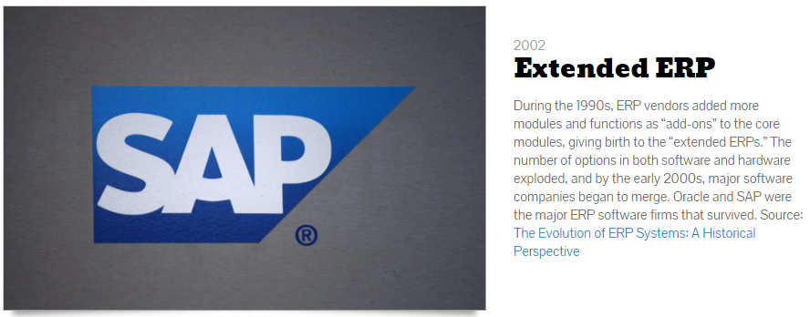
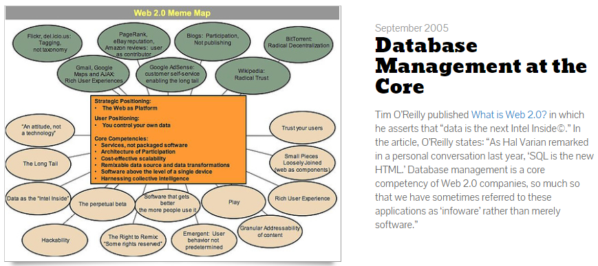
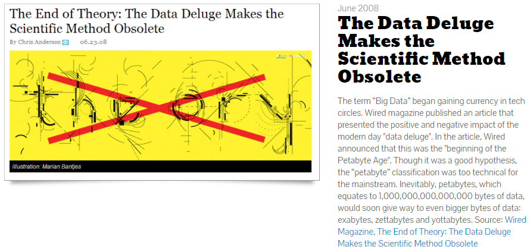

## Big Data
##### The History of Information Storage Tour

---

## Big Data TimeLine

See<a href="https://www.forbes.com/sites/gilpress/2013/05/09/a-very-short-history-of-big-data" target="_blank"> A Very Short History of Big Data </a>for details.

---

## 1875 What is Big Data?

+++

## Source
Press Down key for details. |
See <a href="https://en.wikipedia.org/wiki/Big_data" target="_blank"> Big Data Wiki</a> for details.

+++

#### Wiki

---

##### 1880 The Start of Information Overload

---

##### 1881 The Hollerith Tabulating Machine 

Press Down key for Biography. | See <a href="http://www.columbia.edu/cu/computinghistory/hollerith.html" target="_blank"> Herman Hollerith</a> for details.

+++

#### Herman Hollerith 

---

##### 1932 The Population Boom

---

##### 1940 The Effect on Libraries

---

##### 1941 The Information Explosion

---

##### 1944 The First Warning of Data's Storage and Retrieval Problem

---

##### 1948 Shannon's Information Theory

---

##### 1956 Virtual Memory

---

##### 1961 Scientific Knowledge Expands

---

##### 1962 Pioneering Speech Recognition

---

##### 1963 Looking for an Organizational Solution

---

##### 1966 Centralized Computing Systems Enter the Scene 

---

##### 1970 Relational Data Base

Press Down key for details.

+++

## Source
See <a href="http://www-03.ibm.com/ibm/history/ibm100/us/en/icons/reldb/" target="_blank"> IBM information </a> for details.

---

##### 1975 The Rise in Two-Way Communication

---

##### 1976 Material Requirements Planning Systems (MRP)

---

##### 1980 Parkinson's Law of Data

---

##### 1983 Information Growth and the Broadcasting Industry

---

##### 1985 Manufacturing Resources Planning Systems (MRP II)

---

##### 1985 The Need for Accurate Data 

---

##### 1986 From Clay Tablets to Semiconductor Memory

---

##### 1988 New Software Systems Surface

---

##### 1989 Business Intelligence

---

##### 1992 The First Database Report

---

##### 1995 The World Wide Web Explodes

---

##### 1996 Phenomenal Growth of Computing Power and the Internet 

---

##### 1996 Business Intelligence 2.0 

---

##### 1997 The Problem of Big Data 

---

##### 1997 The Future of Data Storage 

---

##### 1998 The Problem with Business Intelligence 

---

##### 1999 Internet of Thing (IoT) 

---

##### 1999 Information is Quantified 

---

##### 1999 Predictive Analysis Changes Business as Usual 

---

##### 2001 Software as a Service (SaaS)

---

##### 2001 The 3 Vs  

---

##### 2001 Extended ERP 

---

##### 2001 Web Services and ERP 

---

##### 2001 Focus on Usability for End Users 

---

##### 2001 Database Management at the Core 

---

##### 2001 An Open Source Solution to the Big Data Explosion 

 
---

##### 2001 The First Study to Estimate and Forecast the Amount of Information Growth 

---
 
 ##### 2001 Data Continues to Explode 

---

 ##### 2001 The Data Deluge Makes the Scientific Method Obsolete 

---

 ##### 2001 SAP Unveils SaaS Strategy 

 
---

 ##### 2001 Revolutionary Breakthroughs 

 
---

 ##### 2001 Business Intelligence Becomes a Priority 

  
---

 ##### 2001 Linked Data 

  
---

 ##### 2001 ERP Analytics 

  
---

 ##### 2001 How Much Information? 

  
---

  
## Image Slides 2010 continued
## [ Background ]
Press Down key for examples. |
See <a href="https://github.com/gitpitch/gitpitch/wiki/Image-Slides#background" target="_blank">GitPitch Wiki</a> for details.

+++

#### Make A Bold Visual Statement

 

Use high-resolution background images for maximum impact.

+++?image=https://d1z75bzl1vljy2.cloudfront.net/kitchen-sink/victory.jpg

+++?image=https://d1z75bzl1vljy2.cloudfront.net/kitchen-sink/127.jpg

---

## Video Slides
## [ Inline ]
Press Down key for examples. |
See <a href="https://github.com/gitpitch/gitpitch/wiki/Video-Slides" target="_blank">GitPitch Wiki</a> for details.

+++

#### Bring Your Presentations Alive

 

Embed *YouTube*, *Vimeo*, *MP4* and *WebM* inline on any slide.

+++

+++

+++

---

## Video Slides
## [ Background ]
Press Down key for examples. |
See <a href="https://github.com/gitpitch/gitpitch/wiki/Video-Slides#background" target="_blank">GitPitch Wiki</a> for details.

+++

#### Maximize The Viewer Experience

 

Go fullscreen with *MP4* and *WebM* videos.

+++?video=http://clips.vorwaerts-gmbh.de/big_buck_bunny.mp4

---

## Math Notation Slides
Press Down key for examples. |
See <a href="https://github.com/gitpitch/gitpitch/wiki/Math-Notation-Slides" target="_blank">GitPitch Wiki</a> for details.

+++

#### Beautiful Math Rendered Beautifully

 

Use *TeX*, *LaTeX* and *MathML* markup powered by <a target="_blank" href="https://www.mathjax.org/">MathJax</a>.

+++

`$$\sum_{i=0}^n i^2 = \frac{(n^2+n)(2n+1)}{6}$$`

+++

`\begin{align}
\dot{x} & = \sigma(y-x) \\
\dot{y} & = \rho x - y - xz \\
\dot{z} & = -\beta z + xy
\end{align}`

+++

##### The Cauchy-Schwarz Inequality

`\[
\left( \sum_{k=1}^n a_k b_k \right)^{\!\!2} \leq
 \left( \sum_{k=1}^n a_k^2 \right) \left( \sum_{k=1}^n b_k^2 \right)
\]`

+++

##### The probability of getting \(k\) heads when flipping \(n\) coins is:

`\[P(E) = {n \choose k} p^k (1-p)^{ n-k} \]`

+++

##### In-line Mathematics

This expression `\(\sqrt{3x-1}+(1+x)^2\)` is an example of an inline equation.

---

## Slide Fragments
Press Down key for examples. |
See <a href="https://github.com/gitpitch/gitpitch/wiki/Fragment-Slides" target="_blank">GitPitch Wiki</a> for details.

+++

#### Reveal Slide Concepts Piecemeal

 

Step through slide content in sequence to slowly reveal the bigger picture.

+++

- Java
- Groovy |
- Kotlin |
- Scala  |
- The JVM rocks! |

+++

<table>
  <tr>
    <th>Firstname</th>
    <th>Lastname</th> 
    <th>Age</th>
  </tr>
  <tr>
    <td>Jill</td>
    <td>Smith</td>
    <td>25</td>
  </tr>
  <tr class="fragment">
    <td>Eve</td>
    <td>Jackson</td>
    <td>94</td>
  </tr>
  <tr class="fragment">
    <td>John</td>
    <td>Doe</td>
    <td>43</td>
  </tr>
</table>

---
## PITCHME.yaml Settings
Press Down key for examples. |
See <a href="https://github.com/gitpitch/gitpitch/wiki/Slideshow-Settings" target="_blank">GitPitch Wiki</a> for details.

+++

#### Stamp Your Own Look and Feel

 

Set a default theme, custom logo, custom css, background image, and preferred code syntax highlighting style.

+++

#### Customize Slideshow Behavior

 

Enable auto-slide with custom slide intervals, presentation looping, and RTL flow.

---
## Slideshow Keyboard Controls
Press Down key for examples. |
See <a href="https://github.com/gitpitch/gitpitch/wiki/Slideshow-Fullscreen-Mode" target="_blank">GitPitch Wiki</a> for details.

+++

#### Try Out These Great Features Now!

 

| Mode | On Key | Off Key |
| ---- | :------: | :--------: |
| Fullscreen | F |  Esc |
| Overview | O |  O |
| Blackout | B |  B |
| Help | ? |  Esc |

---

## GitPitch Social
Press Down key for examples. |
See <a href="https://github.com/gitpitch/gitpitch/wiki/Slideshow-GitHub-Badge" target="_blank">GitPitch Wiki</a> for details.

+++

#### Slideshows Designed For Sharing

 

- View any slideshow at its public URL
- [Promote](https://github.com/gitpitch/gitpitch/wiki/Slideshow-GitHub-Badge) any slideshow using a GitHub badge
- [Embed](https://github.com/gitpitch/gitpitch/wiki/Slideshow-Embedding) any slideshow within a blog or website
- [Share](https://github.com/gitpitch/gitpitch/wiki/Slideshow-Sharing) any slideshow on Twitter, LinkedIn, etc
- [Print](https://github.com/gitpitch/gitpitch/wiki/Slideshow-Printing) any slideshow as a PDF document
- [Download and present](https://github.com/gitpitch/gitpitch/wiki/Slideshow-Offline) any slideshow offline

---

## GO FOR IT.
## JUST ADD PITCHME.md ;)

